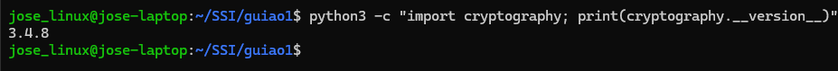

# [Guiao 1](./assets/guiao1.pdf)

### 1. Tarefas preliminares

**Q1.** Qual a versão da biblioteca *cryptography* instalada?

### 2. Cifras clássicas

#### Cifra de César

##### PROG: [cesar.py](./cesar.py)

Escrever o programa [cesar.py](./cesar.py) que receba 3 argumentos:

* o tipo de operação a realizar: enc ou dec
* a chave secreta: A , B , ..., Z
* a mensagem a cifrar, por exemplo "Cartago esta no papo".

##### PROG: [cesar_attack.py](./cesar_attack.py)

Escreva o programa [cesar_attack.py](./cesar_attack.py) que realize um "ataque" à cifra de César. O programa deverá esperar os seguintes argumentos:

* o cryptograma considerado;
* uma sequência não vazia de palavras que poderão ser encontradas no texto-limpo (das palavras apresentadas,
assume-se que pelo menos uma ocorra no texto-limpo).
Como resultado, o programa deverá produzir:
*resposta vazia no caso de não conseguir encontrar uma chave que faça match com uma das palavras fornecidas;*
duas linhas no caso de sucesso
-> A primeira linha com a chave usada na cifra;
-> segunda linha com o texto limpo completo

#### Cifra de Vigenère

##### PROG: [vigenere.py](./vigenere.py)
Crie um novo programa com o nome [vigenere.py](./vigenere.py) que se comporta de forma similar ao programa anterior. A única
diferença é que a chave pode agora ser uma palavra (e não um carácter). 

##### PROG: vigenere_attack.py
Atacar a cifra de Vigenère é consideravelmente mais desafiante. O problema é normalmente abordado considerando
dois sub-problemas: 1) determinar tamanhos prováveis para a chave; e 2) atacar isoladamente cada uma das "fatias" do
criptograma cifradas por cada carácter da chave. O primeiro destes problemas já recorre a uma sofisticação
considerável, pelo que nos focaremos no segundo: atacar as várias cifras de César usadas.

Escreva o programa *vigenere_attack.py* que realize um "ataque" à cifra de Vigenère. O programa deverá esperar os
seguintes argumentos:

* o tamanho da chave;
* o cryptograma considerado;
* uma sequência não vazia de palavras que poderão ser encontradas no texto-limpo (das palavras apresentadas,
assume-se que pelo menos uma ocorre no texto-limpo).
Como resultado, o programa deverá produzir:
resposta vazia no caso de não conseguir encontrar uma chave que faça match com uma das palavras fornecidas;
duas linhas no caso de sucesso
-> A primeira linha com a chave usada na cifra;

##### PROG: otp.py
A cifra One-Time-Pad (OTP) pode ser identificada com a cifra de Vigenère quando a chave é perfeitamente aleatória e
com tamanho não inferior ao texto-limpo. No entanto, é normalmente apresentada no alfabeto binário, em que chave e
texto-limpor são sequência de bits, e a operação para cifrar/decifrar é o XOR (ou exclusivo).

Crie o programa otp.py que se comporta da seguinte forma:
* caso o primeiro argumento do program seja setup , o segundo argumento será o número de bytes aleatórios a gerar
e o terceiro o nome do ficheiro para se escrever os bytes gerados.
* caso o primeiro argumento seja enc , o segundo será o nome do ficheiro com a mensagem a cifrar e o terceiro o
nome do ficheiro que contém a chave one-time-pad.