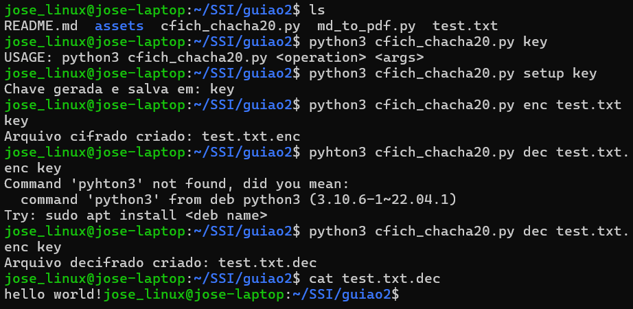

# [Guiao 2](./assets/guiao2.pdf)

## Cifra de Ficheiro
Pretende-se cifrar o conteúdo de um ficheiro, assegurando a *confidencialidade*
dos dados lá armazenados. Para tal iremos experimentar diferentes cifras, por
forma a melhor percebermos as suas propriedades.

**PROG:** [cfich_chacha20.py](./cfich_chacha20.py)
Defina o programa [cfich_chacha20.py](./cfich_chacha20.py) que cifra um ficheiro usando a cifra
sequencial *ChaCha20*. O programa receba como argumentos:

* o tipo de operação a realizar: *setup*, *enc* ou *dec*:
     
    -> setup *<fkey>* cria ficheiro contendo uma chave apropriada para a cifra
    *Chacha20* (com nome *<fkey>*);
     
    -> *enc* *<fich>* *<fkey>* cifra ficheiro passado como argumento *<fich>*, usando
    a chave lida do ficheiro *<fkey>*. O criptograma resultante deverá ser
    gravado *<fich>.enc* (i.e. adiciona a extensão *.enc* ao nome do ficheiro
    de texto-limpo);
     
    -> *dec <fich> <fkey>* decifra criptograma contido em *<fich>*, usando a chave
    lida do ficheiro *<fkey>*. Armazena o texto-limpo recuperado num ficheiro
    com nome *<fich>.dec*.  
     
    **[!TIP]** Note que o *NONCE* utilizado é requerido para decifrar o ficheiro.
    Deve por isso ser gravado juntamente com o criptograma.
     

##### QUESTÃO: Q2 
Qual o impacto de se considerar um NONCE fixo (e.g. tudo 0)?
Que implicações terá essa prática na segurança da cifra?"

**R:** Se o NONCE for fixo, como todos os bytes a zero, a segurança da cifra fica comprometida.
Isso ocorre porque, ao usar o mesmo NONCE em várias encriptações, a sequência gerada para cifrar os dados será sempre a mesma, o que facilita ataques. Um atacante pode comparar os textos encriptados e descobrir informações, ou até modificar as mensagens sem ser detetado.
Portanto, o NONCE deve ser único para garantir a segurança da encriptação.