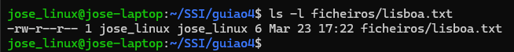
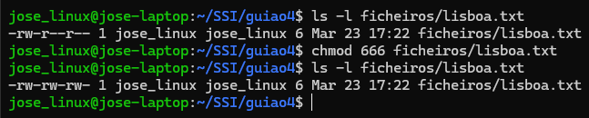
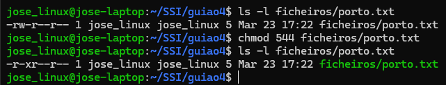
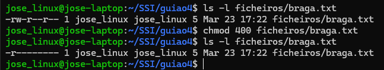
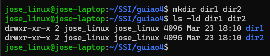
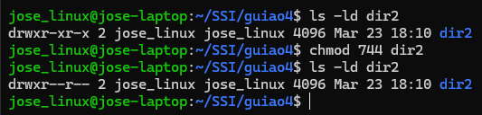
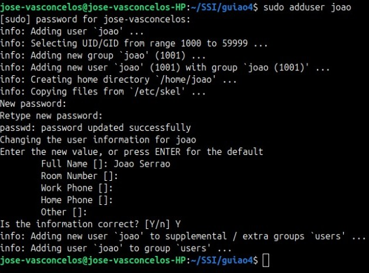
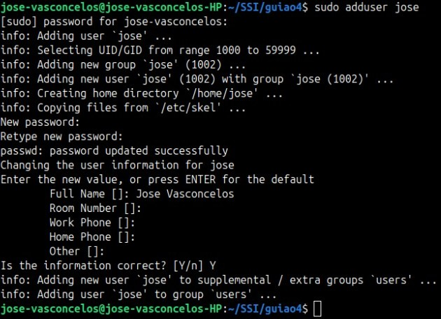
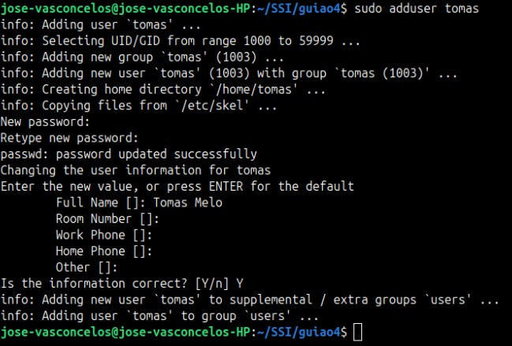

# [Guiao 4](./assets/S6.pdf)

## Exercicios

### Grupo 1

**1.** Crie os ficheiros *[lisboa.txt](./ficheiros/lisboa.txt)*, *[porto.txt](./ficheiros/porto.txt)* e *[braga.txt](./ficheiros/braga.txt)* e inclua um excerto de texto em cada um destes ficheiros.

**2.** Execute o comando necessário para visualizar as permissões referentes ao ficheiro *[lisboa.txt](./ficheiros/lisboa.txt)*.

**3.** Altere as permissões do ficheiro lisboa.txt de modo que o dono (*owner*), o grupo (*group*), e restantes utilizadores (*other*) possuam permissões de leitura e escrita.

* Podem ser utilizadas permissões no formato numérico ou utilizando caracteres.

**4.** Altere as permissões do ficheiro *porto.txt* de modo que o dono possua permissões de **leitura** e **execução**, mas não possua permissões de escrita.

**5.** Altere as permissões do ficheiro *braga.txt* de modo que **apenas** o dono possua permissões de *leitura*.

**6.** Crie as diretorias *dir1* e *dir2* e execute os comandos necessários para visualizar as permissões referentes às mesmas.

**7.** Remova todas as permissões de execução da diretoria *dir2*, exceto para o dono.

### Grupo 2

**0.** Observe o conteúdo dos ficheiros */etc/passwd* e */etc/group*.

**1.** Crie um utilizador para cada membro da equipa.

**2.** Crie o grupo *grupo-ssi* contendo todos os elementos da equipa, e crie um segundo grupo *par-ssi* contendo apenas 2 elementos da equipa.

**3.** Observe novamente o conteúdo dos ficheiros */etc/passwd* e */etc/groups*. Observou alguma diferença?

* Neste exercício, a resposta pode ser dada sob a forma de um comentário no script.

**4.** Altere o dono do ficheiro *braga.txt* para um dos utilizadores criados no ponto 1..

**5.** Leia o conteúdo do ficheiro *braga.txt*.

**6.** Inicie sessão com o utilizador especificado em **3.** .

**7.** Execute os comandos *id* e *groups* e comente o resultado impresso no terminal.

* Neste exercício, a resposta pode ser dada sob a forma de um comentário no *script*.

**8.** Leia o conteúdo do ficheiro *braga.txt*. Observou alguma diferença?.

* Neste exercício, inclua um comentário com uma breve análise do comportamento obtido.

**9.** Mude para diretoria *dir2* e comente o resultado.

* Neste exercício, a resposta pode ser dada sob a forma de um comentário no script.
